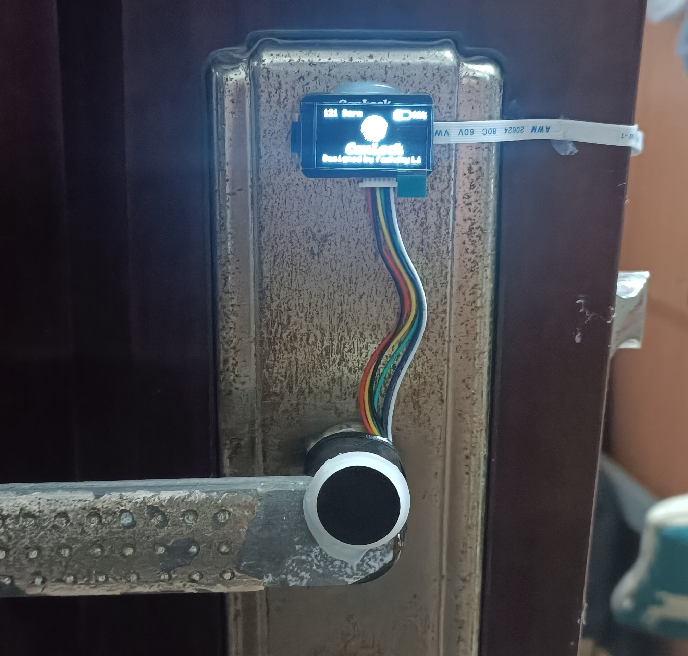

# ConLock

自制寝室指纹锁

## 结构设计

总体外观如下

关于结构的一些说明：

- 电机是用热熔胶粘到门把手上去的，实测能用。
- 电机利用线拉动门把手，不会影响门的正常使用。
- 电机和线的连接是通过法兰联轴器。
- 利用FPC排线连接内外板，FPC厚度小，不会影响开门。
- 线和门把手呈一定角度，这样电机会越拉越轻松。

由于我们寝室的门把手需要的力量比较大，我采用了大减速比的减速电机。这样虽然能够开门，但是速度有点感人。不过能开门才是最重要的。想要提高速度，只能购买那种大减速电机了，但是这样成本就上去了。

我买的这种减速电机因为减速比很大很大，门把手也拉不动，这种小电机也没带编码器。单纯利用延时很容易导致收缩的绳长和放松的绳长不一致，也就是说，用过一段时间后，这个线会越拉越紧，直至拉到能打开的门的程度。不过我用了几天，也就收缩了一点。达到那种程度，应该要很久。不过还是建议，用一段时间放松一次。

## 电路设计

打板文件和原理图文件，工程里面都有。在此，我只对一些注意事项进行简易说明：

1. 采用两节18650，里面的+12v其实是+8v。
2. buck电路采用mp2315芯片。对，没错。就是孙老师开源的那个，开源万岁。不过我对把反馈电阻进行了调整，让其稳到6v。因为我买的电机是6v的，结果发现12v也行。
3. 电机驱动采用的是H桥电路，后面发现只要H桥一切换，单片机就会复位。经过**飞大神**的指导，才知道是mos管死区问题，于是在H桥和电源之间串了一个电阻，建议大小2r，这样才能给电路提供足够的扭矩。
4. 副板OLED电路中的电阻可换为1m。
5. 副板的TVS是用作ESD防护的，也不知道有没有用。

## 软件设计

- 我移植了https://github.com/hello-myj/stm32_oled的开源库（~~原谅我曾想看懂那些算法~~），OLED的UI就是此开源库设计的。另附上UI

  

​		指纹验证成功和失败UI都有相应的变化的，在这里就不放图了。

- 采用ADC采集电池电压，若电池电压低于10%，按指纹就会报警。
- FPM383C（指纹模块）的驱动库可根据文档实现。
- 暂时没有用低功耗模式，因为有一个致命的bug。因为这里的篇幅太小，就不展开叙述了（bushi）。

## 最后

才发现issue都被我提完了，期待友友们的pr:stuck_out_tongue_winking_eye:。
